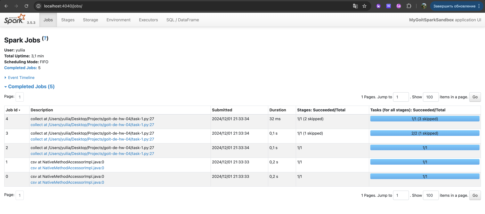
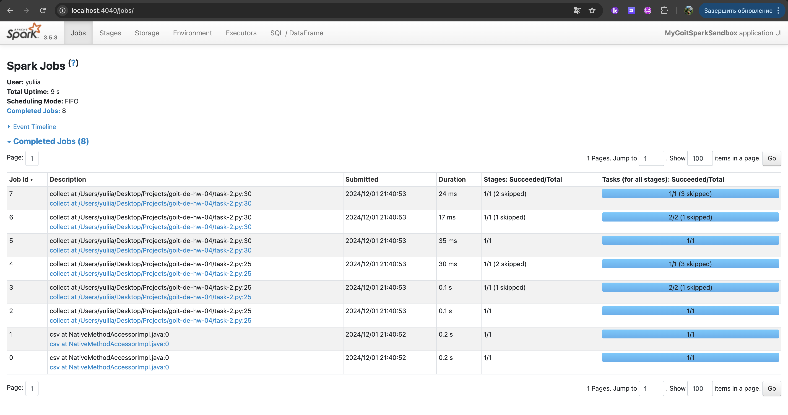
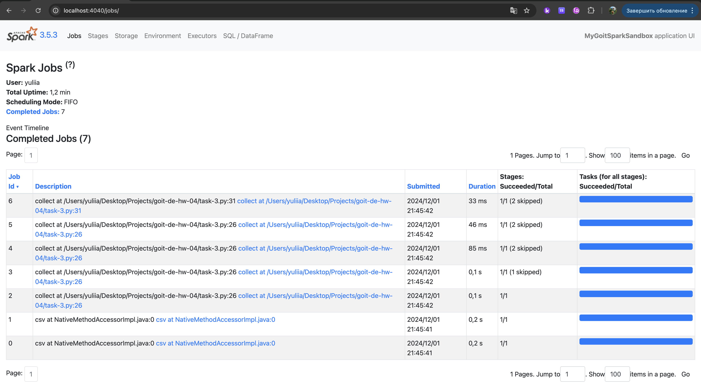

# Домашнє завдання до теми «Apache Spark. Оптимізація та SparkUІ»

Привіт 😉

У цьому домашньому завданні код вже написаний за вас! Але це, можливо, зробить
ДЗ тільки складнішим! Ваше завдання полягає у виконанні декількох варіантів
одного/схожого коду і міркуванні над виглядом SparkUI.

Вам потрібно:

- запустити три програми;
- зробити скриншоти трьох наборів Jobs;
- проаналізувати та вміти обґрунтувати наявність певної кількості Jobs у кожному
  наборі;
- зрозуміти, що робить функція `cache` та навіщо її використовувати.

## Покрокова інструкція виконання

### Частина 1

За основу візьмемо вже знайомий вам код і додамо проміжну дію:

```python
from pyspark.sql import SparkSession

# Створюємо сесію Spark
spark = SparkSession.builder \\ .master("local[*]") \\
.config("spark.sql.shuffle.partitions", "2") \\ .appName("MyGoitSparkSandbox")
\\ .getOrCreate()

# Завантажуємо датасет
nuek_df = spark.read \\ .option("header", "true") \\ .option("inferSchema",
"true") \\ .csv('./nuek-vuh3.csv')

nuek_repart = nuek_df.repartition(2)

nuek_processed = nuek_repart \\ .where("final_priority < 3") \\
.select("unit_id", "final_priority") \\ .groupBy("unit_id") \\ .count()

# Ось ТУТ додано рядок
nuek_processed = nuek_processed.where("count>2")

nuek_processed.collect()

input("Press Enter to continue...5")

# Закриваємо сесію Spark
spark.stop()
```

Запустіть код. Зробіть скриншот усіх Jobs (їх має бути 5).

### Частина 2

Додамо проміжний Action — `collect` :

```python
from pyspark.sql import SparkSession

# Створюємо сесію Spark
spark = SparkSession.builder \\ .master("local[*]") \\
.config("spark.sql.shuffle.partitions", "2") \\ .appName("MyGoitSparkSandbox")
\\ .getOrCreate()

# Завантажуємо датасет
nuek_df = spark.read \\ .option("header", "true") \\ .option("inferSchema",
"true") \\ .csv('./nuek-vuh3.csv')

nuek_repart = nuek_df.repartition(2)

nuek_processed = nuek_repart \\ .where("final_priority < 3") \\
.select("unit_id", "final_priority") \\ .groupBy("unit_id") \\ .count()

# Проміжний action: collect
nuek_processed.collect()

# Ось ТУТ додано рядок
nuek_processed = nuek_processed.where("count>2")

nuek_processed.collect()

input("Press Enter to continue...5")

# Закриваємо сесію Spark
spark.stop()
```

Запустіть код. Зробіть скриншот усіх Jobs (їх має бути 8).

> [!TIP]
>
> 🧠 Подумайте, чому при додаванні однієї проміжної дії
> nuek_processed.collect(), отримано аж на 3 Job більше?

### Частина 3

Використаємо нову для вас функцію `cache` в проміжному результаті.

> [!NOTE]
>
> ☝🏻Функція cache() в PySpark використовується для кешування (зберігання в
> пам'яті) даних RDD (Resilient Distributed Dataset) або DataFrame. Це дозволяє
> прискорити виконання подальших дій (actions) або перетворень
> (transformations), які працюють з тими ж даними. Кешування особливо корисне,
> коли ви виконуєте декілька операцій на одному й тому ж RDD або DataFrame,
> оскільки PySpark не буде повторно обчислювати ті самі дані.

Як працює `cache()` :

1. Кешування в пам'яті. Коли ви викликаєте `cache()` на RDD або DataFrame, дані
   зберігаються в пам'яті (RAM) у розподіленому вигляді на всіх вузлах кластера.
   Це дозволяє прискорити подальші обчислення, оскільки Spark не буде знову
   завантажувати або обчислювати ці дані.

2. Ліниве виконання. Виклик `cache()` не призводить до негайного виконання
   обчислень. Лише коли ви виконуєте дію (action), наприклад, `count()`,
   `collect()`, або `show()`, дані будуть обчислені та кешовані.

3. Механізм зберігання. За замовчуванням, `cache()` використовує пам'ять
   (Memory). Однак, якщо дані не поміщаються в пам'ять, Spark буде зберігати їх
   на диску.

4. Контроль над кешуванням. Коли ви використовуєте `cache()`, Spark зберігає
   дані з рівнем зберігання `MEMORY_ONLY`. Якщо ви хочете використовувати інші
   рівні зберігання, такі як `MEMORY_AND_DISK`, можна використовувати метод
   `persist()`.

> [!NOTE]
>
> ☝🏻Але в такі деталі ми занурюватися на практиці не будемо. Важливо знати, що
> можливо зберігати як в пам’яті, так і на диску. Зберігання в пам’яті набагато
> більш розповсюджене, на диску — екзотика 😉

```python
from pyspark.sql import SparkSession

# Створюємо сесію Spark
spark = SparkSession.builder \\ .master("local[*]") \\
.config("spark.sql.shuffle.partitions", "2") \\ .appName("MyGoitSparkSandbox")
\\ .getOrCreate()

# Завантажуємо датасет
nuek_df = spark.read \\ .option("header", "true") \\ .option("inferSchema",
"true") \\ .csv('./nuek-vuh3.csv')

nuek_repart = nuek_df.repartition(2)

nuek_processed_cached = nuek_repart \\ .where("final_priority < 3") \\
.select("unit_id", "final_priority") \\ .groupBy("unit_id") \\ .count() \\
.cache() # Додано функцію cache

# Проміжний action: collect
nuek_processed_cached.collect()

# Ось ТУТ додано рядок
nuek_processed = nuek_processed_cached.where("count>2")

nuek_processed.collect()

input("Press Enter to continue...5")

# Звільняємо пям'ять від Dataframe
nuek_processed_cached.unpersist()

# Закриваємо сесію Spark
spark.stop()
```

Запустіть код. Зробіть скриншот усіх Jobs (їх має бути 8).

> [!TIP]
>
> 🧠Подумайте, чому при використанні cache() ми зменшили кількість Job?

## Критерії прийняття та оцінювання ДЗ

> [!WARNING]
>
> ☝🏻 Критерії прийняття домашнього завдання є обов’язковою умовою розгляду
> домашнього завдання ментором. Якщо якийсь із критеріїв не виконано, ДЗ
> відправляється ментором на доопрацювання без оцінювання. Якщо вам «тільки
> уточнити»😉 або ви «застопорилися» на якомусь з етапів виконання — звертайтеся
> до ментора у Slack).

Завантажено три скриншоти з Jobs зі сторінки SparkUI
(http://localhost:4040/jobs/).

#### Формат оцінювання — залік/незалік.

Студент отримує оцінку «залік» за умов запуску коду на своїй машині та
завантаження трьох скриншотів з усіма необхідними Jobs зі сторінки SparkUI
(http://localhost:4040/jobs/).

## Підготовка та завантаження домашнього завдання

1. Створіть публічний репозиторій `goit-de-hw-04`.

2. Виконайте завдання та відправте у свій репозиторій у текстовому документі
   зроблені скриншоти Jobs з коротким описом виконання завдання.

3. Збережені на вашому комп’ютері скриншоти також прикріпіть в LMS текстовим
   документом. Назва файла повинна бути у форматі ДЗ4_ПІБ.

4. Прикріпіть посилання на репозиторій`goit-de-hw-04` і відправте на перевірку.

## Формат здачі

- Посилання на репозиторій `goit-de-hw-04`.
- Прикріплений текстовий файл із назвою ДЗ4_ПІБ.

### Результат виконаного завдання № 1



### Результат виконаного завдання № 2



### Результат виконаного завдання № 3


